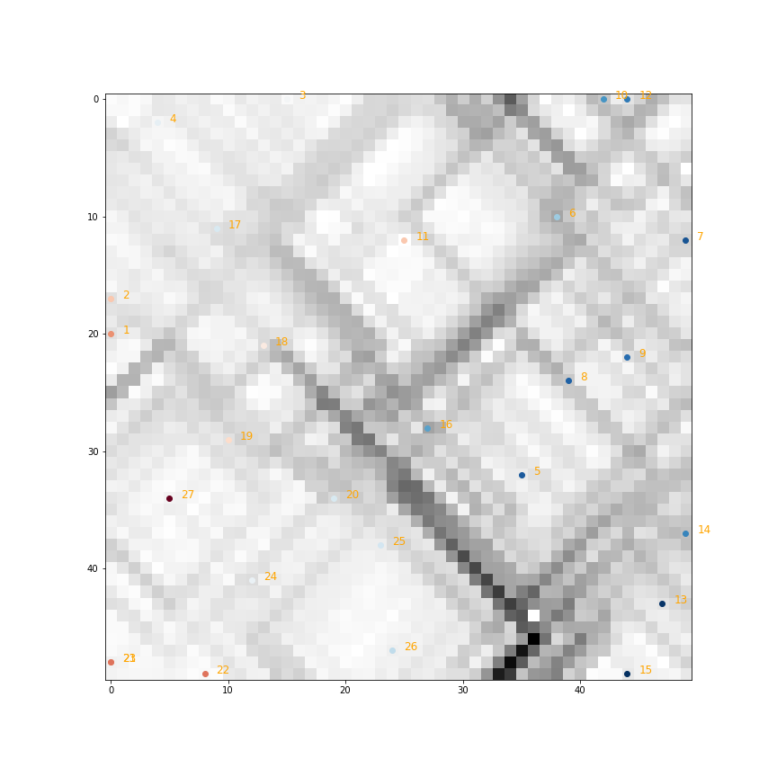

# Self-Organizing Maps and Demographic Data in New York State
## A look at New York's current (for not much longer) congressional districts
<br>

### By Matthew Ward

<br>
<br>

## Section 1: Problem Statement

Spatial proximity is important in geographic analysis. When questions of demography or other attributional data are being investigated, the geographic topology is generally assumed. 
<br> But insights could be gained when removing geography from the picture. Further, when looking at multidimensional data, it is possible to consider it as a whole and not its constituent parts.
<br>
This project is an attempt at organizing New York State demographic data from the multidimensional to the 2nd dimension. Using a self-organizing map can highlight similarities and differences between New York's congressional districts.
<br>
<br>

### Questions:

***What does New York look like demographically, not geographically?***
<br>
<br>

***Can New York's demography be classified in a given space?***

<br>
<br>

## Section 2: Conceptual Model

Gain understanding of New York's congressional districts as a whole by organizing and viewing them as a Self-Organizing Map (SOM)

<br>

***What is a SOM?***
> A SOM is a method of organizing multidimensional data into a lower-dimensional space so that it can be viewed and interpreted more easily.

<br>


^This seems hard to make any conclusions about...

But a SOM can help organize and visualize seemingly overly complicated data.

<br>


^This starts to make some sense...


*Teuvo Kohonen - the inventor of the SOM*
<br>
Credit: [Wikimedia Commons](https://commons.wikimedia.org/wiki/File:Teuvo-Kohonen.jpg)

<br>

So for this use case:

<br>
<br>


<br>

## Section 3: Methodology

> 1. Data cleaning
>   - excel, pandas dataframe
>       - The congressional district ACS data was downloaded in .csv format and cleaned within Microsoft Excel to eliminate certain columns of percentage data and some with very low values (data related to family size, home-ownership levels). The .csv was imported into a python environment as a pandas dataframe.

> 2. Normalization
>   - z-score
>       - The data was normalized using a z-score normalization which creates a mean of 0 and a standard deviation of 1. So in the resulting comparison graph in Section 5, the values below 0 indicate a below average value and the values above an above average value. The data normalization made confined the effects of data outliers and makes it easier to compare variables across the spectrum.

>3. SOM
>   - manhattan distance
>       -Manhattan distance is used to calculate the sphere of influence of a particular 214-dimension input vector (a single congressional district) on the weight vectors (the neurons of the SOM). Over the iterations of each epoch, the Manhattan Distance will decrease as each input vector is confined to a particular area of the SOM and its influence on the weight vector neurons around it diminishes.
>   - pearson distance
>       - Pearson distance was found in Pearson and Cooper (2008) to reduce the impact of normalized outliers which could still have an outsized impact when measuring linear correlation. However, Solo (2019) proved that pearson distance is not a true metric, so the square root of 1 - pearson's r was taken in order to create a metric between the input and weight neurons. This tended to create more delineated U-matrices that showed the differences between all districts to a greater degree.
>   - closest node / BMU
>       - The best matching unit (BMU) was determined via the closest_node function and iteratively called during each epoch to match an input vector with a weight vector neuron. After the SOM was constructed and the U-matrix applied to it to determine the degree (darkness) of dissimilarity between districts, the BMU was again found for the last time once for each district to 'place' it on the final SOM.

>4. U-matrix
>   - pearson distance
>       - Pearson distance was again used in calculating the distance between the now built SOM neurons to determine the distance of their correlation.

>5. Label and plot
>   - closest node
>       - As mentioned above in part 3, the closest node for each congressional district was assigned one final time after SOM and U-matrix were complete.
>   - color map on two slope norm
>       - The districts were plotted as points on 'top' of the SOM / U-matrix based on their closest node match. They were colored on a two slope norm because their distribution was not even around 0 (there are many more much heavier-leaning Democratic districts in New York State). The darker the red shade, the more Republican-leaning a district (maximum +11) and the darker a blue shade, the more Democrat-leaning a district (maximum +44).
>   - district label
>       - The district label was drawn offset from the district point and colored orange for clarity. Some districts are still overlapping in SOM trainings with fewer epochs because there may have been no discernable differences formed yet or the district may not have even been mapped to the SOM yet because the input vector (district) is randomly chosen for each epoch.

<br>

## Python code
<details>
<summary>here</summary>

```python
# code adapted from McCaffrey, 2019
# package imports
from scipy import stats
import matplotlib.pyplot as plt
from matplotlib import colors
import pandas as pd
import numpy as np

# background functions to process / prepare data

# remove the columns containing category labels (non-numeric data)
def numerize_data(df):
    columns = df.columns
    for i in range(len(columns)):
        if df[columns[i]].dtype == 'object':
            df = df.drop([columns[i]], axis=1)
    return df

# transpose the data table (cols <-> rows)
def data_transpose(df):
    tdf = df.transpose()
    return tdf

# normalize data with z-score ('compact' values to lower impact of outliers and make data more comparable)
def z_normalize(df):
        columns = df.columns
        z_score_list = []
        for z in range(len(df)):
            stage_list = []
            for i in range(len(columns)):
                stage_list.append(df[columns[i]][z])
            z_stage = np.array(stage_list)
            # print(z_stage)
            z_scores = stats.zscore(z_stage)
            z_score_list.append(z_scores)
        return z_score_list

# build array from normalized data
def build_darray(z_list):
    row = len(z_list)
    col = len(z_list[0])
    stage_array = np.ndarray(shape=(row, col))
    for i in range(row):
        stage_array[i] = z_list[i]
    z_array = stage_array
    return z_array

# convert the .csv of Cook PVI scores for New York State into a 2-slope classification with Democrat PVI as positive and Republican PVI as negative (the original scores were both in the positive slope)
# returns a dataframe with 2 columns, one for the district number and one for its respective +/- PVI score (no district in NY is '0' PVI)
def process_ref_table(pvi):
    df_pvi = pd.read_csv(pvi)
    for i in range(df_pvi.shape[0]):
        for j in range(df_pvi.shape[1]):
            if j == 0:
                df_pvi.loc[i][j] = i+1
            else:
                if "D" in df_pvi.loc[i][j]:
                    df_pvi.loc[i][j] = df_pvi.loc[i][j].split("+")[1]
                else:
                    df_pvi.loc[i][j] = int(df_pvi.loc[i][j].split("+")[1])*-1
    df_pvi['dist'] = df_pvi['dist'].astype(int)
    df_pvi['pvi'] = df_pvi['pvi'].astype(int)
    return df_pvi

# SOM-related functions
# find closest node (from sample code)
# returns (row,col) of map node closest to data[t]
def closest_node(data, t, som, m_rows, m_cols):
  result = (0,0)
  small_dist = 1.0e20  # floating point number 1
  for i in range(m_rows):
    for j in range(m_cols):
      pd = pearson_dist(som[i][j], data[t])  # for each neuron (square) of the input grid (particular district) find the pearson regression distance to the closest SOM (weight) neuron (square) 
      if pd < small_dist:  # if the pearson distance is less than float 1.0, then that is the closest neuron to the input vector
        small_dist = pd
        result = (i, j)
  return result  # return the x,y of the closet neuron

# manhattan distance between cells (from sample code)
# this function is used to compute the current sphere of influence of the input vector on the weight neurons.
# this will return a smaller distance every iteration called during the construction of the SOM
# this is proportional to the current pct_left
def manhattan_dist(r1, c1, r2, c2):
  return np.abs(r1-r2) + np.abs(c1-c2)

# pearson distance between input vector and weight vector
def pearson_dist(v1,v2):
    # print(v1)
    # print(v2)
    pearson = stats.pearsonr(v1, v2)
    # print(pearson)
    dist = np.sqrt(1 - pearson[0])  # metric of pearson distance showing higher resolution distance between vectors
    return dist                     # adapted from Solo, 2019

# main program runtime
def main():
    rng = np.random.default_rng()
    rng.random()
    dim = 214
    rows = 30; cols = 30
    rangeMax = rows + cols
    learnMax = 0.95
    stepsMax = 10

    # load / process ACS and PVI tables
    file = r"ny_edit.csv"
    pvi = r"pvi.csv"
    df = pd.read_csv(file)
    df_pvi = process_ref_table(pvi)
    dist_label = np.array(df_pvi['dist'])  # array of district numbers (1 - 27)
    # print(dist_label)
    pvi = np.array(df_pvi['pvi'])  # array of PVI scores
    # print(pvi)
    
    # call numerize, transpose,  normalize and array build functions
    w = numerize_data(df)
    # print(w)
    p = data_transpose(w)
    # print(p)
    h = z_normalize(p)
    # print(h)
    q = build_darray(h)
    # print(len(q))
    # print(q.shape)

    # construct SOM (the weight neurons)
    print(f"Constructing a {rows}x{cols} SOM with {stepsMax} epochs from the NY ACS data")
    som = np.random.random_sample(size=(rows, cols, dim))
    # print(som)

    for s in range(stepsMax):  # this keeps track of the progress of the SOM construction
        pct_left = 1.0 - ((s * 1.0) / stepsMax)
        if s % (stepsMax/10) == 0: 
            print("step: ", str(s))
            print(int(round(pct_left*100,0)), "% of epochs left to go") 
        curr_range = int(pct_left * rangeMax)
        curr_rate = pct_left * learnMax
    
        t = np.random.randint(len(q))
        # print(t)
        # print(q)
        (bmu_row, bmu_col) = closest_node(q, t, som, rows, cols)
        for i in range(rows):
            for j in range(cols):
                if manhattan_dist(bmu_row, bmu_col, i, j) < curr_range:
                    som[i][j] = som[i][j] + curr_rate * (q[t] - som[i][j])
    print("SOM construction complete \n")

    # construct U-matrix (highlight the dissimilarity between clusters as darker grid squares)
    print("Constructing U-Matrix from SOM")
    u_matrix = np.zeros(shape=(rows, cols))
    for i in range(rows):
        for j in range(cols):
            v = som[i][j] # vector
            sum_dists = 0.0; ct = 0
            if i-1 >= 0:
                sum_dists += (1 - pearson_dist(v, som[i-1][j])); ct += 1
            if i+1 <= rows - 1:
                sum_dists += (1 - pearson_dist(v, som[i+1][j])); ct += 1
            if j-1 >= 0:
                sum_dists += (1 - pearson_dist(v, som[i][j-1])); ct += 1
            if j+1 <= cols - 1:
                sum_dists += (1 - pearson_dist(v, som[i][j+1])); ct += 1
            u_matrix[i][j] = sum_dists / ct
    
    plt.figure(figsize=(12,12))
    plt.imshow(u_matrix, alpha=1, cmap='gray')
    # plt.show()
    print("U-matrix complete")

    # visualize the district labels (colored by their respective PVI) on the U-matrix
    cmap = plt.get_cmap('RdBu')
    offset = colors.TwoSlopeNorm(vmin=min(pvi), vcenter=0., vmax=max(pvi))
    norm = offset(pvi)
    #print(norm)
    #print(cmap(norm[0]))
    
    for t in range(len(q)):
        (m_row, m_col) = closest_node(q, t, som, rows, cols)  
        plt.scatter(m_col, m_row, color=cmap(norm[t]))
        plt.text(m_col+1, m_row, dist_label[t], color = 'orange', fontsize=12)
    
    plt.savefig(f"som_{str(rows)}x{str(cols)}_{str(stepsMax)}steps.png", format="png")
    plt.show()
 
if __name__=="__main__":
    main()
```

</details>

<br>

## Section 4. Results

<p style="text-align:center; font-size: 30px">Small SOM (15x15 with 30 epochs)</p>


<br>

<p style="text-align:center; font-size: 30px">Bigger (30x30 with 30 epochs)</p>


<br>

<p style="text-align:center; font-size: 30px">Ideal size (50x50) with 30 epochs</p>
<br>
<p style="text-align:center; font-size: 30px">But need more training to classify better</p>


<br>
<br>
<br>
<p style="text-align:center; font-size: 30px">1,000 epochs</p>



<br>
<br>

<p style="text-align:center; font-size: 30px">5,000 epochs</p>


<p style="text-align:center; font-size: 30px">10,000 epochs</p>
<p style="text-align:center; font-size: 20px">I colored the districts within New York City a light purple to show the geographic delineation of NYC vs non-NYC districts. 


<br>
<br>

## Section 5: Discussion

So the results show that there are differences between the districts. Some are classified into larger clusters and several only have a cluster to themselves. There is also a clear separation of districts within New York City (all on the left of the SOM) and districts outside of NYC. There appear to be three major striations of the districts within the big city while the districts outside have less differences between each other. I took a closer look at two of the districts, 15 and 23 to compare their demographic data.

<br>


<br>

Here is a breakdown of their demographic data:
<br>
There are some notable differences between the districts. First, geographically speaking District 15 is entirely within The Bronx. District 23 comprises a large portion of southwestern New York along the Pennsylvania border. Looking at the comparison between the districts District 23 has many more residents on private health insurance than District 15. District 15 has many more residents in rental housing. Residents of District 15 are much more likely (above average) than residents of District 23 to use public transportation. This is logical given New York City's transit network compared to southwestern New York. District 23 residents are much more likely (above average) to drive to work alone. District 15 residents are much more likely (above average) to be foreign born. District 15 residents are much more likely to be of Hispanic or Latino heritage as well as Black or African-American. District 23 is overwhelmingly White. The biggest differences in these districts concern the race of residents, housing, health insurance, and commute patterns.


<br>

<details>

<summary>Code to produce the graph:</summary>

```python
# a closer look at three of the districts classified above, NY-15, NY-23
# load data
file = r"ny_edit.csv"
df = pd.read_csv(file)
df['mean'] = np.mean(df, axis=1)
df['sd'] = np.std(df.iloc[:, 3:30], axis=1)
df2 = df.iloc[:, 2:]

# create dataframe of z-score normalized data
df4 = stats.zscore(df2.iloc[:, 1:28])
df4['title'] = df2['title']  # add attribute labels

# horizontal bar plot of the same data
ticks = np.arange(214)  # x-axis tickmarks
labels = df4['title'].tolist()  # x-axis labels
X = np.arange(len(labels))
#plt.figure(figsize=(75,12))  # figure size

ny15 = df4['d15']  # district 5 data values
ny23 = df4['d23']  # district 13 data values
width = .3  # bar width

fig, ax = plt.subplots(figsize=(12,75))
plt.yticks(ticks, labels)
# ax.barh(labels, ny5, width, label='NY-5')
ax.barh(X-0.2, ny15, width, label='NY-15')
ax.barh(X+0.2, ny23, width, label='NY-23')

ax.legend()

plt.show()
```

</details>
<br>

## Section 6: Conclusion

SOMs can clarify seemingly complicated datasets. They provide insights into general similarity and dissimilarity that affords a closer look into those differences/similarities. Because they are an unsupervised neural network, they have a lot of flexibility in their construction. They however are also somewhat limited in their ability to recognize or learn to identify particular features or signifiers. I believe they are a valuable method to providing a different way of looking at complex multidimensional data and perhaps can inspire initial further questions when investigating data relationships.

<br>

## Section 7: Sources / References

Ba&ccedil;&atilde;o, F., Lobo, V., & Painho, M. (2008). Applications of Different Self-Organizing Maps Variants to Geographical Information Science Problems. In *Self-Organising Maps* (pp. 21-44). John Wiley & Sons, Ltd. https://doi.org/10.1002/9780470021699.ch2

McCaffrey, J. (2019). Self-Organizing Maps Using Python. Visual Studio Magazine. https://visualstudiomagazine.com/articles/2019/01/01/self-organizing-maps-python.aspx

Pearson, P.T. & Cooper, C.I. (2008). Using Self Organizing Maps to Analyze Demographics and Swing State Voting in the 2008 U.S. Presidential Election. In *Artificial Neural Networks in Pattern Recognition* (pp. 201-212). Springer Berlin Heidelberg. https://doi.org/10.1007/978-3-642-33212-8_19

Ponmalai, R. & Kamath, C. (2019). Self-Organizing Maps and Their Applications to Data Analysis. United States. https://doi.org/10.2172/1566795

Solo, V. (2019). Pearson Distance is not a Distance. Unpublished Manuscript. University of New South Wales. https://arxiv.org/abs/1908.06029

United States Census Bureau. (n.d.) My Congressional District. https://www.census.gov/mycd/?st=30